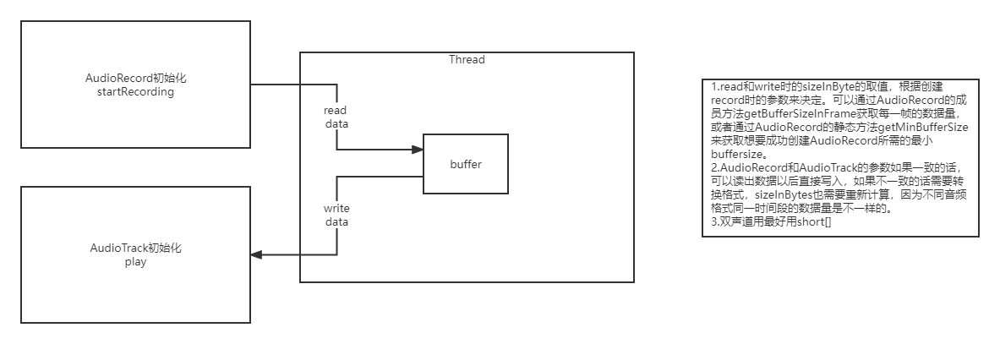
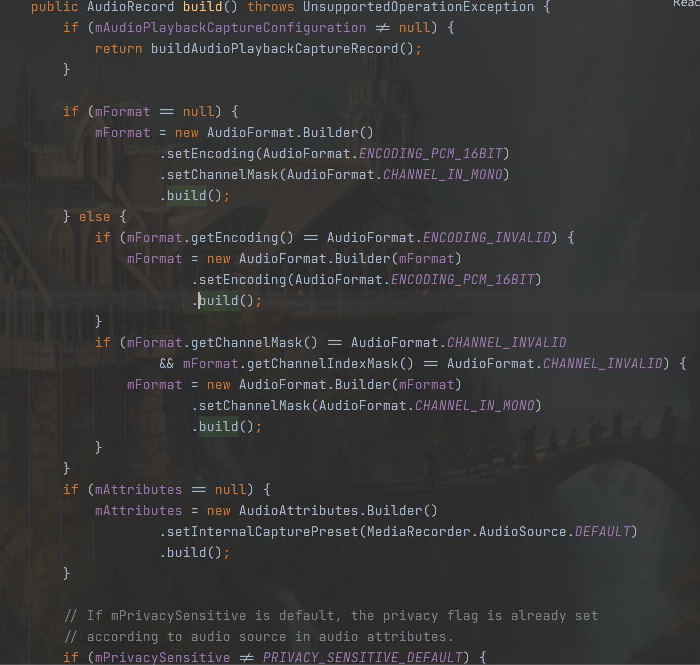
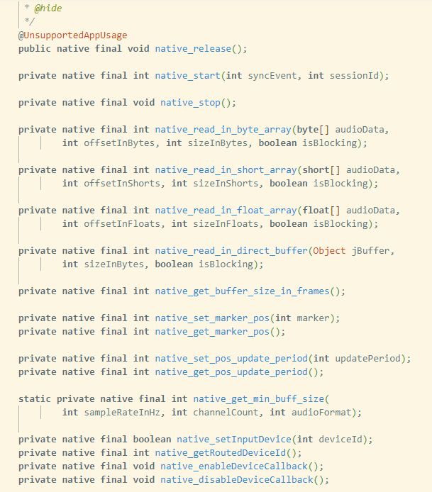

##### 主要代码

- record初始化：

  ```java
  AudioRecord record = new AudioRecord.Builder()
                      .setAudioFormat(
                              new AudioFormat.Builder()
                                      .setSampleRate(48000)
                                      .setChannelMask(AudioFormat.CHANNEL_IN_STEREO)
                                      .setEncoding(AudioFormat.ENCODING_PCM_8BIT)
                                      .build()
                      )
                      .setAudioSource(MediaRecorder.AudioSource.MIC)
                      .build();
  ```

  <center>构建用到了Builer模式，见./设计模式/Builder模式.md</center>

- track初始化

  ```java
  AudioTrack track = new AudioTrack.Builder()
                      .setAudioFormat(
                              new AudioFormat.Builder()
                                      .setEncoding(AudioFormat.ENCODING_PCM_8BIT)
                                      .setChannelMask(AudioFormat.CHANNEL_IN_STEREO)
                                      .setSampleRate(48000)
                                      .build()
                      )
                      .build();
  ```

- run

  ```java
  bufferSize = record.getBufferSizeInFrames();
  recBuffer = new byte[bufferSize];
  if (record.getState() == AudioRecord.STATE_INITIALIZED){
      record.startRecording();
      isRunning = true;
  }
  
  if (track != null && track.getState() == AudioTrack.STATE_INITIALIZED){
      track.play();
  }
  while (isRunning){
      readSize = record.read(recBuffer, 0, bufferSize);
      if (track != null && track.getState() == AudioTrack.STATE_INITIALIZED){
          track.write(recBuffer, 0, readSize);
      }
      try {
          Thread.sleep(10);
      } catch (InterruptedException e) {
          e.printStackTrace();
      }
  }
  ```

- 关键点：buffer的size要选好，不然会有杂音断音问题。可以通过getBufferSizeInFrames获取一帧的数据量，也可以通过AudioRecord.getMinBufferSize()获取最小buffer大小，根据传入的音频参数不同数据量会有所不同。

- 

##### 结合源码

###### 初始化时都做了哪些事情？

- AudioRecord init 

  - 第一个判断是取决于是否在构建时用setAudioPlaybackCaptureConfig传入AudioPlaybackCaptureConfiguration对象。在该类里面可以看到如下注释：

    > Configuration for capturing audio played by other apps. When capturing audio signals played by other apps (and yours), you will only capture a mix of the audio signals played by players (such as AudioTrack or MediaPlayer) which present the following characteristics:

    大致意思是该配置用于配置捕获其他app音频的一些设置，而在下面的buildAudioPlaybackCaptureRecord()里面能看到创建AudioMix对象，还有一些AudioPolicy的配置，大概推测应该是用该方法创建的AudioRecord能混合其他app的音频数据。

  - 后面则是一些AudioRecord的音频配置属性的判空和默认值赋值。

  - build()方法最后会调到下方构造函数（包括官网上面api文档给出的构造函数，最后也都会调用到这个构造函数。）：

    > ```
    > private AudioRecord(AudioAttributes attributes, AudioFormat format, int bufferSizeInBytes,
    >             int sessionId, @Nullable Context context,
    >             int maxSharedAudioHistoryMs) throws IllegalArgumentException {
    >         mRecordingState = RECORDSTATE_STOPPED;
    > 
    >         ......
    > 
    >         audioParamCheck(mAudioAttributes.getCapturePreset(), rate, encoding);
    > 
    >         ......
    > 
    >         //TODO: update native initialization when information about hardware init failure
    >         //      due to capture device already open is available.
    >         try (ScopedParcelState attributionSourceState = attributionSource.asScopedParcelState()) {
    >             int initResult = native_setup(new WeakReference<AudioRecord>(this), mAudioAttributes,
    >                     sampleRate, mChannelMask, mChannelIndexMask, mAudioFormat,
    >                     mNativeBufferSizeInBytes, session, attributionSourceState.getParcel(),
    >                     0 /*nativeRecordInJavaObj*/, maxSharedAudioHistoryMs);
    >             if (initResult != SUCCESS) {
    >                 loge("Error code " + initResult + " when initializing native AudioRecord object.");
    >                 return; // with mState == STATE_UNINITIALIZED
    >             }
    >         }
    > 
    >         ......
    >         mState = STATE_INITIALIZED;//将状态置为已初始化
    >     }
    > ```

    - 省略掉部分代码，先看一下**audioParamCheck**这个函数，这个是用来检测参数是否合法的，由下面代码可以看到采样率有很多限制:

      > //--------------
      > // sample rate
      > if ((sampleRateInHz < AudioFormat.SAMPLE_RATE_HZ_MIN ||
      >         sampleRateInHz > AudioFormat.SAMPLE_RATE_HZ_MAX) &&
      >         sampleRateInHz != AudioFormat.SAMPLE_RATE_UNSPECIFIED) {
      >     throw new IllegalArgumentException(sampleRateInHz
      >             \+ "Hz is not a supported sample rate.");
      > }
      > mSampleRate = sampleRateInHz;

      那么这么限制是怎么来的呢？跟到AudioFormat可以看到是从AudioSystem中拿到的，而AudioSystem里面可以看到是通过native调用，继续到android_media_AudioSystem.cpp里面可以看到竟然是写死的：

      > **static** jint android_media_AudioSystem_getMaxSampleRate(JNIEnv *****env, jobject thiz) {
      >
      >   *// see frameworks/av/services/audiopolicy/common/include/policy.h*
      >
      >   return 192000; *// SAMPLE_RATE_HZ_MAX (for API)*
      >
      > }
      >
      > 
      >
      > **static** jint android_media_AudioSystem_getMinSampleRate(JNIEnv *****env, jobject thiz) {
      >
      >   return 4000; *// SAMPLE_RATE_HZ_MIN  (for API)*
      >
      > }

      不过我觉得不应该是这样的，从getMaxSampleRate中的注释来看，应该是可以在audiopolicy里面配置的，再结合日常工作，应该是和节点的hw_params参数有关联。但是我暂时没找到frameworks/av在哪个库里面，先搁置。

    - 再看构造函数的最后面，调用到了native_setup，这个函数会调到android_media_AudioRecord.cpp里面。而且这个函数会传入一个当前对象的弱引用，也就是说在android_media_AudioRecord.cpp里面是可以回调到当前java对象的，同样java层其实也保留有一个native层的引用对象（nativeRecordInJavaObj）。并且在AudioRecord.java代码里面能看到还有很多native方法，这些在cpp里面都有对应，所以其实上层AudioRecord也相当于是一个中间层，实际的实现都是通过c++调用的，这一点跟中间件差不多。

      

- AudioTrack init

  - 跟AudioRecord一样，不管是通过Builder还是公共构造函数调用最后都会走到下方构造函数：

    > ```java
    > private AudioTrack(AudioAttributes attributes, AudioFormat format, int bufferSizeInBytes,
    >         int mode, int sessionId, boolean offload, int encapsulationMode,
    >         @Nullable TunerConfiguration tunerConfiguration)
    >                 throws IllegalArgumentException {
    >     super(attributes, AudioPlaybackConfiguration.PLAYER_TYPE_JAM_AUDIOTRACK);
    >     // mState already == STATE_UNINITIALIZED
    > 
    >     mConfiguredAudioAttributes = attributes; // object copy not needed, immutable.
    > 
    >     if (format == null) {
    >         throw new IllegalArgumentException("Illegal null AudioFormat");
    >     }
    > 
    >     // Check if we should enable deep buffer mode
    >     if (shouldEnablePowerSaving(mAttributes, format, bufferSizeInBytes, mode)) {
    >         mAttributes = new AudioAttributes.Builder(mAttributes)
    >             .replaceFlags((mAttributes.getAllFlags()
    >                     | AudioAttributes.FLAG_DEEP_BUFFER)
    >                     & ~AudioAttributes.FLAG_LOW_LATENCY)
    >             .build();
    >     }
    > 
    >     // remember which looper is associated with the AudioTrack instantiation
    >     Looper looper;
    >     if ((looper = Looper.myLooper()) == null) {
    >         looper = Looper.getMainLooper();
    >     }
    > 
    >     int rate = format.getSampleRate();
    >     if (rate == AudioFormat.SAMPLE_RATE_UNSPECIFIED) {
    >         rate = 0;
    >     }
    > 
    >     int channelIndexMask = 0;
    >     if ((format.getPropertySetMask()
    >             & AudioFormat.AUDIO_FORMAT_HAS_PROPERTY_CHANNEL_INDEX_MASK) != 0) {
    >         channelIndexMask = format.getChannelIndexMask();
    >     }
    >     int channelMask = 0;
    >     if ((format.getPropertySetMask()
    >             & AudioFormat.AUDIO_FORMAT_HAS_PROPERTY_CHANNEL_MASK) != 0) {
    >         channelMask = format.getChannelMask();
    >     } else if (channelIndexMask == 0) { // if no masks at all, use stereo
    >         channelMask = AudioFormat.CHANNEL_OUT_FRONT_LEFT
    >                 | AudioFormat.CHANNEL_OUT_FRONT_RIGHT;
    >     }
    >     int encoding = AudioFormat.ENCODING_DEFAULT;
    >     if ((format.getPropertySetMask() & AudioFormat.AUDIO_FORMAT_HAS_PROPERTY_ENCODING) != 0) {
    >         encoding = format.getEncoding();
    >     }
    >     audioParamCheck(rate, channelMask, channelIndexMask, encoding, mode);
    >     mOffloaded = offload;
    >     mStreamType = AudioSystem.STREAM_DEFAULT;
    > 
    >     audioBuffSizeCheck(bufferSizeInBytes);
    > 
    >     mInitializationLooper = looper;
    > 
    >     if (sessionId < 0) {
    >         throw new IllegalArgumentException("Invalid audio session ID: "+sessionId);
    >     }
    > 
    >     int[] sampleRate = new int[] {mSampleRate};
    >     int[] session = new int[1];
    >     session[0] = sessionId;
    >     // native initialization
    >     int initResult = native_setup(new WeakReference<AudioTrack>(this), mAttributes,
    >             sampleRate, mChannelMask, mChannelIndexMask, mAudioFormat,
    >             mNativeBufferSizeInBytes, mDataLoadMode, session, 0 /*nativeTrackInJavaObj*/,
    >             offload, encapsulationMode, tunerConfiguration,
    >             getCurrentOpPackageName());
    >     if (initResult != SUCCESS) {
    >         loge("Error code "+initResult+" when initializing AudioTrack.");
    >         return; // with mState == STATE_UNINITIALIZED
    >     }
    > 
    >     mSampleRate = sampleRate[0];
    >     mSessionId = session[0];
    > 
    >     // TODO: consider caching encapsulationMode and tunerConfiguration in the Java object.
    > 
    >     if ((mAttributes.getFlags() & AudioAttributes.FLAG_HW_AV_SYNC) != 0) {
    >         int frameSizeInBytes;
    >         if (AudioFormat.isEncodingLinearFrames(mAudioFormat)) {
    >             frameSizeInBytes = mChannelCount * AudioFormat.getBytesPerSample(mAudioFormat);
    >         } else {
    >             frameSizeInBytes = 1;
    >         }
    >         mOffset = ((int) Math.ceil(HEADER_V2_SIZE_BYTES / frameSizeInBytes)) * frameSizeInBytes;
    >     }
    > 
    >     if (mDataLoadMode == MODE_STATIC) {
    >         mState = STATE_NO_STATIC_DATA;
    >     } else {
    >         mState = STATE_INITIALIZED;
    >     }
    > 
    >     baseRegisterPlayer(mSessionId);
    >     native_setPlayerIId(mPlayerIId); // mPlayerIId now ready to send to native AudioTrack.
    > }
    > ```

    同样有audioParamCheck，不同的是比起AudioRecord，AudioTrack少了audio source的检测，多了一个编码格式的检测。跟进到AudioFormat里面还能看到很多Encoding_ACC、DOLBY之类的买耳机经常能看到但是又不了解具体含义的字段，看起来好像都是编码格式类型。

  - 同样还有android_media_AudioTrack.cpp文件与AudioTrack.java对应，相互调用。


为什么sample rate没有固定常量？